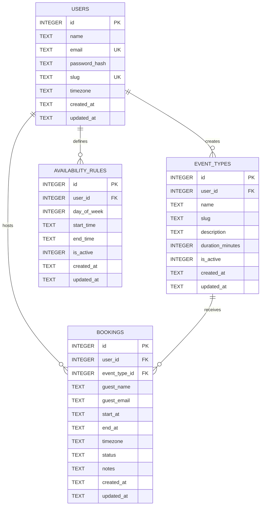

# MeetFlow MVP — Entity Relationship Diagram

## 1. Overview

MeetFlow uses Cloudflare D1 as the primary relational database.

The MVP contains four core tables:

```text
users
event_types
availability_rules
bookings
```

Relationship:

```text
users
  |
  +----< event_types
  |
  +----< availability_rules
  |
  +----< bookings
             |
             +---- event_types
```

Rendered diagram: [erd.png](erd.png)

---

## 2. Mermaid ERD



---

## 3. `users`

Stores host accounts.

| Column        | Type    | Required | Description                     |
| ------------- | ------- | -------- | ------------------------------- |
| id            | INTEGER | Yes      | Primary key                     |
| name          | TEXT    | Yes      | Host name                       |
| email         | TEXT    | Yes      | Login email (stored lowercased) |
| password_hash | TEXT    | Yes      | Secure password hash            |
| slug          | TEXT    | Yes      | Public username                 |
| timezone      | TEXT    | Yes      | IANA timezone                   |
| created_at    | TEXT    | Yes      | Creation timestamp              |
| updated_at    | TEXT    | Yes      | Last update timestamp           |

Constraints:

```sql
PRIMARY KEY (id)
UNIQUE (email)
UNIQUE (slug)
```

`password_hash` format (PBKDF2-SHA256 via Web Crypto):

```text
pbkdf2$<iterations>$<salt-base64>$<hash-base64>
```

Example:

```text
id: 1
name: Wan
email: wan@example.com
slug: wan
timezone: Asia/Kuala_Lumpur
```

Public profile:

```text
/wan
```

---

## 4. `event_types`

Defines meetings that the host offers.

| Column           | Type    | Required | Description              |
| ---------------- | ------- | -------- | ------------------------ |
| id               | INTEGER | Yes      | Primary key              |
| user_id          | INTEGER | Yes      | Host                     |
| name             | TEXT    | Yes      | Event name               |
| slug             | TEXT    | Yes      | Public URL slug          |
| description      | TEXT    | No       | Event description        |
| duration_minutes | INTEGER | Yes      | Meeting duration         |
| is_active        | INTEGER | Yes      | 1 = active, 0 = inactive |
| created_at       | TEXT    | Yes      | Creation timestamp       |
| updated_at       | TEXT    | Yes      | Last update timestamp    |

Foreign key:

```text
event_types.user_id
    ->
users.id
```

Constraint:

```sql
UNIQUE(user_id, slug)
```

Example:

```text
name: Consultation
slug: consultation
duration_minutes: 30
```

Public URL:

```text
/wan/consultation
```

---

## 5. `availability_rules`

Stores recurring weekly availability, expressed in the host's timezone.

| Column      | Type    | Required | Description           |
| ----------- | ------- | -------- | --------------------- |
| id          | INTEGER | Yes      | Primary key           |
| user_id     | INTEGER | Yes      | Host                  |
| day_of_week | INTEGER | Yes      | 0–6                   |
| start_time  | TEXT    | Yes      | HH:MM                 |
| end_time    | TEXT    | Yes      | HH:MM                 |
| is_active   | INTEGER | Yes      | 1 = active            |
| created_at  | TEXT    | Yes      | Creation timestamp    |
| updated_at  | TEXT    | Yes      | Last update timestamp |

Day mapping:

```text
0 = Sunday
1 = Monday
2 = Tuesday
3 = Wednesday
4 = Thursday
5 = Friday
6 = Saturday
```

Example:

```text
Monday
09:00 - 12:00

Monday
14:00 - 17:00
```

These are two rows.

Rules are validated server-side: `start_time < end_time`, both matching `^([01]\d|2[0-3]):[0-5]\d$`,
and `day_of_week BETWEEN 0 AND 6`.

---

## 6. `bookings`

Stores appointments.

| Column        | Type    | Required | Description            |
| ------------- | ------- | -------- | ---------------------- |
| id            | INTEGER | Yes      | Primary key            |
| user_id       | INTEGER | Yes      | Host                   |
| event_type_id | INTEGER | Yes      | Event type             |
| guest_name    | TEXT    | Yes      | Guest name             |
| guest_email   | TEXT    | Yes      | Guest email            |
| start_at      | TEXT    | Yes      | UTC start              |
| end_at        | TEXT    | Yes      | UTC end                |
| timezone      | TEXT    | Yes      | Guest/booking timezone |
| status        | TEXT    | Yes      | Booking status         |
| notes         | TEXT    | No       | Guest notes            |
| created_at    | TEXT    | Yes      | Creation timestamp     |
| updated_at    | TEXT    | Yes      | Last update timestamp  |

Foreign keys:

```text
bookings.user_id
    ->
users.id

bookings.event_type_id
    ->
event_types.id
```

Status values:

```text
confirmed
cancelled
completed
```

`start_at` / `end_at` / `created_at` / `updated_at` are fixed-width ISO-8601 UTC strings:

```text
YYYY-MM-DDTHH:MM:SSZ
```

Fixed width matters: SQLite compares TEXT lexicographically, and this format makes lexicographic
order equal chronological order. Never store a variant with milliseconds or an offset suffix.

---

## 7. SQL Schema

Initial D1 schema (`migrations/0001_initial.sql`):

```sql
PRAGMA foreign_keys = ON;

CREATE TABLE users (
    id INTEGER PRIMARY KEY AUTOINCREMENT,
    name TEXT NOT NULL,
    email TEXT NOT NULL UNIQUE,
    password_hash TEXT NOT NULL,
    slug TEXT NOT NULL UNIQUE,
    timezone TEXT NOT NULL DEFAULT 'UTC',
    created_at TEXT NOT NULL,
    updated_at TEXT NOT NULL
);

CREATE TABLE event_types (
    id INTEGER PRIMARY KEY AUTOINCREMENT,
    user_id INTEGER NOT NULL,
    name TEXT NOT NULL,
    slug TEXT NOT NULL,
    description TEXT,
    duration_minutes INTEGER NOT NULL,
    is_active INTEGER NOT NULL DEFAULT 1,
    created_at TEXT NOT NULL,
    updated_at TEXT NOT NULL,

    FOREIGN KEY (user_id)
        REFERENCES users(id)
        ON DELETE CASCADE,

    UNIQUE(user_id, slug)
);

CREATE TABLE availability_rules (
    id INTEGER PRIMARY KEY AUTOINCREMENT,
    user_id INTEGER NOT NULL,
    day_of_week INTEGER NOT NULL,
    start_time TEXT NOT NULL,
    end_time TEXT NOT NULL,
    is_active INTEGER NOT NULL DEFAULT 1,
    created_at TEXT NOT NULL,
    updated_at TEXT NOT NULL,

    FOREIGN KEY (user_id)
        REFERENCES users(id)
        ON DELETE CASCADE
);

CREATE TABLE bookings (
    id INTEGER PRIMARY KEY AUTOINCREMENT,
    user_id INTEGER NOT NULL,
    event_type_id INTEGER NOT NULL,
    guest_name TEXT NOT NULL,
    guest_email TEXT NOT NULL,
    start_at TEXT NOT NULL,
    end_at TEXT NOT NULL,
    timezone TEXT NOT NULL,
    status TEXT NOT NULL DEFAULT 'confirmed',
    notes TEXT,
    created_at TEXT NOT NULL,
    updated_at TEXT NOT NULL,

    FOREIGN KEY (user_id)
        REFERENCES users(id),

    FOREIGN KEY (event_type_id)
        REFERENCES event_types(id)
);
```

---

## 8. Indexes

```sql
CREATE INDEX idx_event_types_user_id
ON event_types(user_id);

CREATE INDEX idx_availability_rules_user_id
ON availability_rules(user_id);

CREATE INDEX idx_availability_rules_user_day
ON availability_rules(user_id, day_of_week);

CREATE INDEX idx_bookings_user_id
ON bookings(user_id);

CREATE INDEX idx_bookings_event_type_id
ON bookings(event_type_id);

CREATE INDEX idx_bookings_start_at
ON bookings(start_at);

CREATE INDEX idx_bookings_user_start
ON bookings(user_id, start_at);

-- Race guard: a host can never hold two confirmed bookings starting at the same instant.
CREATE UNIQUE INDEX idx_bookings_unique_confirmed_start
ON bookings(user_id, start_at)
WHERE status = 'confirmed';
```

---

## 9. Booking Overlap

A booking overlaps another booking when:

```text
existing.start_at < requested.end_at
AND
existing.end_at > requested.start_at
```

SQL:

```sql
SELECT id
FROM bookings
WHERE user_id = ?
  AND status = 'confirmed'
  AND start_at < ?   -- requested end_at
  AND end_at > ?     -- requested start_at
LIMIT 1;
```

If a result exists:

```text
The requested slot is unavailable.
```

### Atomic conditional insert

D1 has no interactive transactions, so the check and the insert must be one statement:

```sql
INSERT INTO bookings (
    user_id, event_type_id, guest_name, guest_email,
    start_at, end_at, timezone, status, notes, created_at, updated_at
)
SELECT ?, ?, ?, ?, ?, ?, ?, 'confirmed', ?, ?, ?
WHERE NOT EXISTS (
    SELECT 1 FROM bookings
    WHERE user_id = ?
      AND status = 'confirmed'
      AND start_at < ?
      AND end_at > ?
);
```

`meta.changes === 0` means the slot was taken between slot listing and submission — return
`409 Conflict`. The partial unique index in section 8 is the second line of defence.

---

## 10. Booking Creation Logic

The application must NOT trust the availability returned to the browser.

When creating a booking:

```text
1. Load event type by (host slug, event slug)
2. Verify event type is active
3. Verify event type belongs to host
4. Parse requested date/time
5. Convert to UTC
6. Validate requested slot against availability
7. Check existing overlapping bookings
8. Create booking
9. Return confirmation
```

The availability and overlap checks must happen on the server.

`end_at` is always derived server-side as `start_at + duration_minutes`. The client never sends it.

---

## 11. Data Ownership

A host owns:

```text
users
  |
  +-- event_types
  |
  +-- availability_rules
  |
  +-- bookings
```

Every authenticated request must verify ownership.

Example:

```sql
SELECT *
FROM event_types
WHERE id = ?
  AND user_id = ?;
```

Never load an event type only by ID for an authenticated operation.

---

## 12. Deletion Rules

### User

Do not physically delete users in the MVP unless required.

### Event Type

Prefer deactivation over deletion.

```text
is_active = 0
```

Historical bookings should remain intact.

### Availability

Availability rules may be deleted and recreated. `PUT /api/availability` replaces the full weekly
set for the host in one D1 `batch()` (delete-all + insert-all).

### Booking

Do not physically delete bookings.

Use:

```text
status = 'cancelled'
```

---

## 13. Timezone Strategy

Store booking timestamps in UTC.

Example:

```text
start_at:
2026-09-21T01:00:00Z

end_at:
2026-09-21T01:30:00Z
```

Store the relevant timezone separately:

```text
Asia/Kuala_Lumpur
```

Never implement timezone conversion manually using fixed offsets.
Use IANA timezone identifiers.

Examples:

```text
Asia/Kuala_Lumpur
Asia/Singapore
Asia/Bangkok
Asia/Jakarta
Europe/London
America/New_York
```

Conversion is done with `Intl.DateTimeFormat` + `formatToParts` (full ICU is available in
`workerd`), which handles DST correctly for zones like `Europe/London` and `America/New_York`.

---

## 14. Future Tables

Do NOT create these tables in the initial MVP unless the feature is actually being implemented:

```text
sessions
calendar_connections
calendar_events
availability_overrides
booking_questions
booking_answers
reminders
webhook_events
email_jobs
teams
team_members
locations
```

Possible future structure:

```text
users
 |
 +-- event_types
 |
 +-- availability_rules
 |
 +-- availability_overrides
 |
 +-- calendar_connections
 |
 +-- bookings
       |
       +-- booking_questions
       +-- booking_answers
       +-- reminders
```

---

## 15. Cloudflare Service Mapping

### D1

Source of truth.

Store:

- Users
- Event types
- Availability
- Bookings

### KV

Optional cache. Never use KV as the primary source of booking truth.

Potential use:

```text
Public event page cache
Availability cache
Rate limiting
Short-lived sessions
```

### R2

Optional file storage.

Potential use:

```text
Avatar
Logo
Uploaded images
Attachments
```

### Queues

Background jobs.

Potential use:

```text
Booking confirmation email
Reminder email
Calendar synchronization
Webhook processing
```

### Cron

Scheduled operations.

Potential use:

```text
Reminder processing
Cleanup
Calendar sync
Maintenance
```

---

## 16. Database Principle

D1 is the source of truth.

Critical booking state must always exist in D1.

Do not store the only copy of:

- Booking status
- Booking time
- Availability
- Event configuration

in KV or R2.

---

## 17. MVP Database Philosophy

Keep the schema small.

Do not create tables for future features before they are required.

The initial database should remain:

```text
users
event_types
availability_rules
bookings
```

This keeps the project easy to understand, test and modify with AI coding agents.
